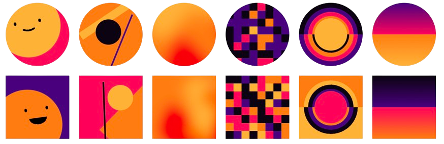

## Overview

<p align="center">
  
</p>

Generate deterministic, SVG-only Boring Avatars (Beam, Bauhaus, Marble, Pixel, Ring and Sunset) in Go - ready for
servers, CDNs, CLI tools or front-ends.

> Credit where it's due - this port would not exist without the original, beautifully crafted
> JavaScript project by Boring Designers: https://github.com/boringdesigners/boring-avatars/tree/master
> Please consider supporting their project with a star and a donation!

## Features

- Six sleek Boring Avatar styles.
- Deterministic: same (style, name, palette) -> identical SVG.
- Plug-and-play HTTP server with Chi + functional middleware options.

## Installing

```shell
go get -u github.com/sig-0/boring-avatars-go
```

## Library usage

```go
package main

import (
	"fmt"

	"github.com/sig-0/boring-avatars-go/avatars"
)

func main() {
	svg := avatars.Generate(
		avatars.Marble,                                                  // style
		"Amelia Earhart",                                                // name / seed
		[]string{"#0a0310", "#49007e", "#ff005b", "#ff7d10", "#ffb238"}, // optional custom palette
		80,                                                              // size in px
		false,                                                           // square mask? (false = round)
	)

	fmt.Println(svg) // <svg …/>
}

```

## Embedded HTTP server

```go
package main

import (
	"context"
	"log"
	"log/slog"

	"github.com/sig-0/boring-avatars-go/server"
)

func main() {
	srv, _ := server.New(
		server.WithLogger(slog.Default()), // custom logger
		// optional middlewares
	)

	ctx, cancel := context.WithCancel(context.Background())
	defer cancel()

	log.Fatal(srv.Serve(ctx)) // blocking
}

```

### REST API

The root endpoint of the bundled HTTP server allows you to generate Boring Avatar SVGs.
You can configure the CORS policy in the server configuration, by running the `generate` command and editing the file.

#### Base endpoint

```text
GET /?name={NAME}&variant={VARIANT}&size={SIZE}&colors={COLORS}&square=true
```

All parameters are optional unless otherwise noted.

#### Params

##### `name` (optional)

A string used to generate a unique avatar (e.g., username, email, or ID).

```html
?name=Maria%20Mitchell" crossorigin>
```

##### `variant` (optional)

Specifies the visual style of the avatar. Options include:

- `marble`
- `beam`
- `pixel`
- `sunset`
- `ring`
- `bauhaus`

```html
?variant=beam" crossorigin>
```

##### `size` (optional)

The width and height of the avatar in pixels (SVG format).

```html
?size=240" crossorigin>
```

##### `colors` (optional)

A comma-separated list of up to 6 hex color values used to style the avatar.

```html
?colors=264653,2a9d8f,e9c46a,f4a261,e76f51" crossorigin>
```

##### `square` (optional)

Forces the avatar to render in a square format. Accepts `true` or `false`.

```html
?square=true" crossorigin>
```

### Random Avatars

If you omit all query parameters, the endpoint returns a randomly generated avatar using the default size (`80x80`) and
the `marble` variant:

```html
" crossorigin>
```
